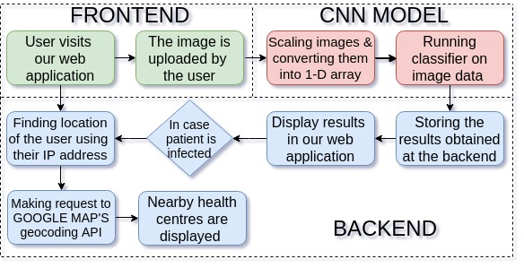
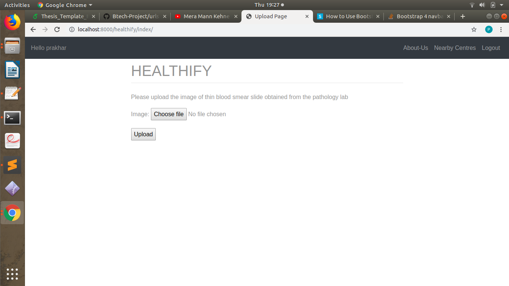
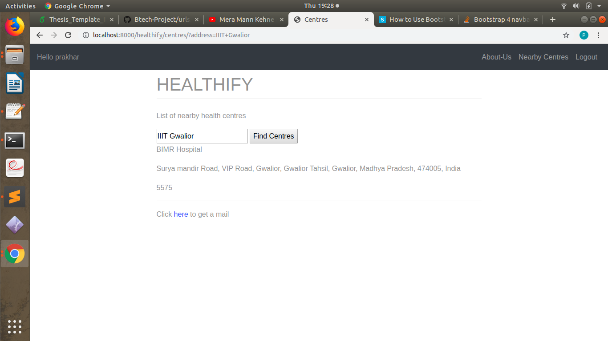
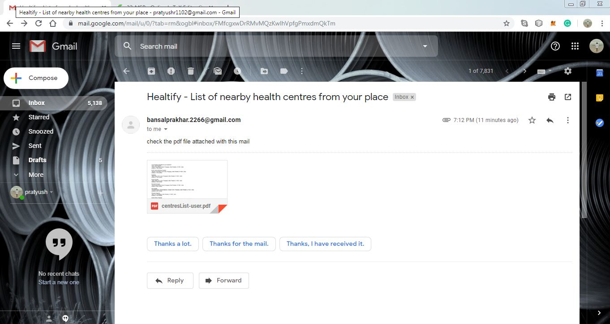

# IP project (Cell Imaging)
A web application that accurately predicts if a person is suffering from malaria or not. Besides this, a list of nearby healthcentres is also displayed to the user based upon his/her location.

## Demo Video (https://www.youtube.com/watch?v=1gIsWAS8Zt8)
[Watch the video here](https://www.youtube.com/watch?v=1gIsWAS8Zt8)
  
## Approach

According to the World Health Organization (WHO),there are over 200 million malaria cases and there are approximately 400,000 deaths due to malaria every year. The diagnosis of a disease like malaria depends heavily upon the level of human expertise & can be impacted by variability in observation of the expert. Also, this manual-based approach takes a considerable amount of time in its accomplishment. To counter this, we developed a CNN based deep learning model for the detection of Malaria, a mosquito-borne blood disease. The model has been deployed in the form of a web application that is very user friendly and can be handled by a naive user.

## Workflow
The user firt signs up for a free account --> The user is then required to login --> The user then uploads the image of thin blood smears with the form presented to him/her --> The model is run on that image and the results are presented to the user --> The user also has the choice to view the nearby health centres for malaria treatment.

## Technology Stack

  <li>Language Used </li>
    <ul>python</ul>
  <li>Machine learning and Deep learning</li>
    <ul>keras, Scikitlearn, numpy, pandas, opencv etc.</ul>
  <li> Web Technologies</li>
    <ul>Django, HTML, CSS </ul>

## Getting Started

To test, contribute or just see what we did follow few easy steps:
- clone the repository
- Install python3 and python3-pip on your machine
- then create a new virtual environment(env) to work with the current project
- run the virtual enviroment by source env/bin/activate
- install django 2.0.5 using the command 'pip3 install django==2.0.5'
- then we need to setup PostgreSQL to work django 
  Here is the link on how to setup PostgreSQL for django-
  https://www.digitalocean.com/community/tutorials/how-to-use-postgresql-with-your-django-application-on-centos-7
- Create a new database and a new user to handle that database
- Change the database settings in settings.py file - 
  for reference - 
  https://www.digitalocean.com/community/tutorials/how-to-use-postgresql-with-your-django-application-on-centos-7
- Create a new superuser that will act as admin - 
  python3 manage.py createsuperuser
- migrate all the changes to the database by the command-
  python3 manage.py makemigrations
  python3 manage.py migrate
- Now, your local development enviroment is set. To run the server , type python3 manage.py runserver. By default, the server
  will start on port 8000.

## Contributing
1. Fork it (<https://github.com/prakhar070/ip_project-cell-imaging-/>)
2. Create your feature branch (`git checkout -b feature/fooBar`)
3. Commit your changes (`git commit -am 'Add some fooBar'`)
4. Push to the branch (`git push origin feature/fooBar`)
5. Create a new Pull Request

<h2>Working Demo </h2>

The user visits the web application. At the home page of the application, the user
is asked to upload the image of the thin blood smear slides.

The user uploads the image and the pre-trained classifier then runs on the image
to provide the result. In case the user is found infected, then he can choose to
view the nearby healthcentres.

The coordinates of the user location is then extracted using the IP address of the
device. The user also has the option to enter his location manually. In case the
user enter his location manually, the address is first converted to the correspond-
ing coordinates using geocoding. The coordinates of the nearby healtcentres are
then obtained by using the google Map API. Finally, these coordinates are con-
verted to readable address using reverse geo-coding.

The user is also given an option to receive the list of nearby health-centres in the
form of PDF as an email.

